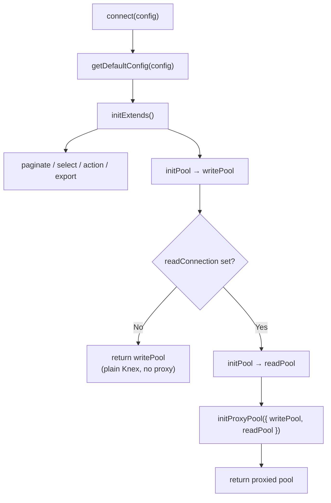
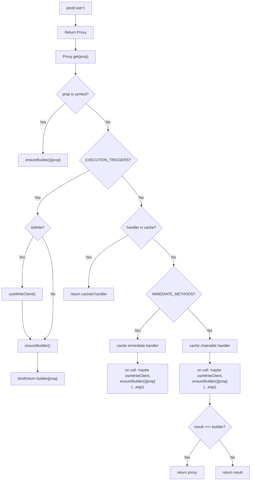
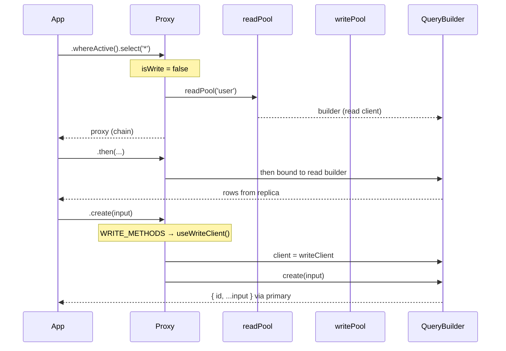
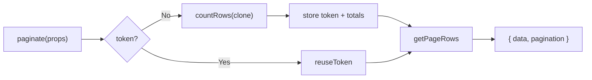

# knexify — Development Guide

Internal documentation for developers who maintain or extend this package.
For consumer usage examples, see [README.md](../README.md).

## Package purpose

`knexify` wraps Knex.js and adds:

- Optional **read / write connection splitting** via a proxy pool
- Automatic **snake_case ↔ camelCase** conversion
- Shared QueryBuilder helpers: select, action, paginate, export
- Typed model factory (`createModel`)

Target runtime is PostgreSQL (`client: 'pg'` by default).

---

## Source layout

```text
src/
  index.ts              # connect(), createModel(), public exports
  config.ts             # Knex config + case conversion hooks
  proxy.ts              # Read/write proxy pool (only when readConnection set)
  types.ts              # Connection, Model, QueryBuilder, Paging, …
  knexfile.ts           # Migration / seed Knexfile helper
  helper.ts             # toCamelCase
  extends/
    select-query.ts     # find, exists, search, whereActive
    action-query.ts     # create, patch, remove, upsertOn
    paginate.ts         # paginate + in-memory token store
    export.ts           # streaming CSV export
```

---

## Boot flow



### Why skip the proxy when there is no replica?

Proxying every method call has a cost. If only one connection exists, `connect()`
returns the write Knex instance directly so QueryBuilder methods run with no
intercept overhead.

---

## Case conversion

Configured in `config.ts` on every Knex instance:

| Hook | Direction | Behavior |
|------|-----------|----------|
| `wrapIdentifier` | JS → SQL | `firstName` → `first_name` |
| `postProcessResponse` | SQL → JS | `first_name` → `firstName` |
| Buffer values | SQL → JS | treated as boolean (`readInt8()`) |

Disable with `disableCaseConversion: true`.

**Implication for helpers:** prefer camelCase field names in updates
(`deletedAt`, `updatedAt`) so `wrapIdentifier` maps them. Filters that use
raw snake_case (`whereNull('deleted_at')`) also work because they already match
SQL identifiers.

---

## Models

```typescript
const userModel = createModel(pool, 'user');
userModel();        // pool('user') — proxied when applicable
userModel(trx);    // pool('user').transacting(trx)
```

Always use `createModel` so table access goes through the same pool object
returned by `connect()` (plain Knex or proxied).

To force a specific connection:

```typescript
const writePool = pool.write;
const userModel = createModel(writePool, 'user');
```

(`pool.write` / `pool.read` exist only on the proxied pool.)

---

## Proxy pool — deep dive

File: `src/proxy.ts`.

### Goals

1. Route **reads** to the replica and **writes** to the primary.
2. Keep a **real Knex QueryBuilder** on the hot path (no call-log replay).
3. If a chain starts as a read and later calls a write method, **rebind
   `queryBuilder.client`** to the write client instead of rebuilding the query.
4. Cache per-property handlers to reduce Proxy `get` cost on long chains.

### Surface API of the proxied pool

| Member | Behavior |
|--------|----------|
| `pool(tableName)` | Returns a Proxy that lazily builds a QueryBuilder |
| `pool.read` | Underlying read Knex instance |
| `pool.write` | Underlying write Knex instance |
| `pool.transaction(...)` | Always `writePool.transaction(...)` |
| `pool.raw(sql, bindings?)` | SELECT → read; anything else → write |

### Method classification

Three sets drive routing:

```text
WRITE_METHODS
  insert, update, del, delete, truncate,
  increment, decrement, forUpdate, forShare,
  create, patch, remove, upsertOn, transacting

IMMEDIATE_METHODS  (return Promise / non-chainable result)
  create, patch, remove, upsertOn, paginate, export, exists

EXECUTION_TRIGGERS  (run or inspect the built SQL)
  then, catch, finally, toSQL, toQuery, toString, stream, asCallback
```

- **Write methods** flip `isWrite` and may swap the client.
- **Immediate methods** call through once and return the helper’s Promise.
- **Execution triggers** ensure the builder exists on the correct client, then
  bind/return Knex’s own method.
- **Everything else** (e.g. `where`, `select`, `orderBy`) is treated as
  chainable: if Knex returns `this`, the Proxy returns **itself** so chaining
  stays on the proxy.

### Per-table proxy state

Each `pool(tableName)` call creates an isolated closure:

```text
queryBuilder : Knex.QueryBuilder | null   // created lazily
isWrite      : boolean                    // starts false (prefer read)
handlerCache : Map<string, Function>      // memoized Proxy handlers
```

### Request routing flow



### `ensureBuilder` and `useWriteClient`



**Lazy create:** the builder is not created until the first real method or
execution trigger runs. The first create picks `readPool` or `writePool`
based on `isWrite` at that moment.

**Client rebind:** if the builder was already created on the read client and a
write method appears later, only `queryBuilder.client` is replaced with
`writePool.client`. Dialects must match (both pools come from the same
`connect()` config). This avoids replaying a call log.

### Example chains

**Read-only (replica):**

```typescript
userModel().whereActive().select('*').then(...)
// ensureBuilder → readPool → then on read
```

**Write helper (primary):**

```typescript
userModel().create(input)
// IMMEDIATE + WRITE → useWriteClient → writePool → create()
```

**Mixed chain (rebind):**

```typescript
userModel().where({ id: 1 }).update({ status: 'active' })
// where → builder on read
// update → WRITE → rebind client to write → update runs on primary
```

**Raw SQL:**

```typescript
pool.raw('select 1');           // read
pool.raw('update user set …');  // write
```

### Extending the proxy

When you add a new QueryBuilder helper in `src/extends/`:

1. Register it with `knex.QueryBuilder.extend(...)`.
2. If it **mutates data** (or must see primary / locks), add its name to
   `WRITE_METHODS`.
3. If it **returns a Promise immediately** (not chainable), also add it to
   `IMMEDIATE_METHODS`.
4. If it only **filters / shapes** a SELECT, leave it out of both sets so it
   stays on the read path.
5. Declare the method on `QueryBuilder` in `src/types.ts` and in the
   `declare module 'knex'` block.
6. Document it in [README.md](../README.md).

Checklist for a new write helper named `restore`:

```text
[ ] action-query.ts → knex.QueryBuilder.extend('restore', …)
[ ] proxy.ts        → WRITE_METHODS.add('restore')
[ ] proxy.ts        → IMMEDIATE_METHODS.add('restore')  // if Promise
[ ] types.ts        → QueryBuilder + Knex module augmentation
[ ] README.md       → usage example
```

---

## QueryBuilder extensions

All extensions use `knex.QueryBuilder.extend` so they apply to every Knex
instance created after `initExtends()` runs (including both read and write
pools).

### Select — `extends/select-query.ts`

| Method | Role |
|--------|------|
| `find(id, where?)` | `where({ id, … }).first()` |
| `exists(where)` | boolean via `.first()` |
| `search(q, fields)` | `orWhereILike` across fields (chainable) |
| `whereActive(where?)` | `whereNull('deleted_at')` + optional where |

`search` does **not** paginate. Chain `.paginate(...)` when needed.

### Action — `extends/action-query.ts`

| Method | Role |
|--------|------|
| `create(data, trx?)` | insert → `{ id, ...data }` |
| `patch(id, data, trx?)` | update active row + `updatedAt` |
| `remove(id, trx?)` | soft-delete via `deletedAt` |
| `upsertOn(data, keys, trx?)` | insert / onConflict merge + `updatedAt` |

Timestamps use `current_timestamp` from the builder’s client.

Transactions: optional last argument, or `userModel(trx).create(...)`.

### Paginate — `extends/paginate.ts`

In-memory token store (process-local):

```text
No token  → create UUID, COUNT once, store { total, totalPages, … }, return page
Has token → skip COUNT, reuse stored totals, fetch page only
```



**Caveats for extenders:**

- Token store is **not** shared across Node processes / pods.
- Totals can go stale until a new token is created.
- Invalid / unknown token → `Error('Invalid pagination token.')`.

### Export — `extends/export.ts`

Streams rows to a CSV file with write backpressure. Returns the file path.
Listed in `IMMEDIATE_METHODS` so the proxy invokes it as a one-shot Promise.

---

## Adding a new extension (step by step)

1. Implement in `src/extends/<name>.ts` using `knex.QueryBuilder.extend`.
2. Call the initializer from `initExtends()` in `src/index.ts`.
3. Update proxy sets if the method writes or is immediate.
4. Update `src/types.ts` (exported `QueryBuilder` + Knex augmentation).
5. Keep functions small, promise/`.then` style, JTDoc + `@example`.
6. Update README consumer docs and this guide if behavior is structural.

---

## Transactions

Rules of thumb (also in workspace DB rules):

- Do **not** wrap pure SELECT in a transaction.
- Use transactions for multi-step writes.
- Prefer select first, then `pool.transaction(...)` for actions.

On a proxied pool, `pool.transaction` always uses the write pool. Inside the
transaction callback, pass `trx` into the model: `userModel(trx).patch(...)`.
`transacting` is a `WRITE_METHODS` entry so the proxy stays on the primary.

---

## Testing and lint

```bash
npm run eslint
npm test
npm run build
```

Build output goes to `build/` (`tsconfig` `outDir`).

---

## Design constraints / future work

| Topic | Current state | Notes |
|-------|---------------|-------|
| Read replicas | Single `readConnection` | Multi-replica round-robin not implemented |
| Pagination tokens | In-memory `Record` | Not durable; fine for single-process APIs |
| Proxy without replica | Skipped | Returns plain write Knex |
| Case conversion | On by default | Opt out via `disableCaseConversion` |

When changing proxy behavior, prefer keeping the “real QueryBuilder + client
rebind” model. Reintroducing call-log replay increases latency and complexity.

---

## Quick reference — files to touch

| Change | Primary files |
|--------|----------------|
| New select helper | `extends/select-query.ts`, `types.ts`, maybe `proxy.ts` |
| New action helper | `extends/action-query.ts`, `types.ts`, `proxy.ts` |
| Pagination behavior | `extends/paginate.ts`, `types.ts` |
| Connection / case | `config.ts`, `types.ts` |
| Read/write routing | `proxy.ts`, `index.ts` |
| Public API docs | `README.md` |
| Maintainer docs | `docs/DEVELOPMENT.md` (this file) |
